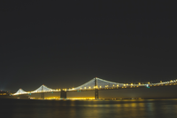

<!--
SPDX-FileCopyrightText: 2019-2020 Tuomas Siipola
SPDX-FileCopyrightText: 2020 Johannes Siipola

SPDX-License-Identifier: AGPL-3.0-or-later
-->

# Perceptual Image Optimizer


[](https://reuse.software)

`pio` is a command-line utility to compress image files while maintaining the same perceived quality.
It's designed to automatically optimize images for the web.

## Features

- Optimize images automatically for the web
- Supports PNG, JPEG and WebP
- Easily installable statically linked binary (for Linux and macOS)

## Background

Images are an important part of the web but they usually use a lot of bandwidth (see HTTP Archive's [Page Weight](https://httparchive.org/reports/page-weight) for statistics).
Optimizing images makes them smaller and thus faster to load.

How much should you optimize images?
Many image editors and optimization tools only give you parameters such as quality or file size.
You could use the same parameters for each image.
This will certainly optimize your images but may not be optimal for all images.
You could also specify parameters by hand for each image but this isn't feasible if there are many images or they are uploaded by end users.

`pio` simplifies image optimization by finding optimal parameters automatically.
This is done by optimizing the input image with different qualities and comparing [structural similarity (SSIM)](https://en.wikipedia.org/wiki/Structural_similarity).

### Example

Here we can see that `pio` finds different quality parameter for different images (using default settings).
In general images with a lot of details require higher quality than those with fewer details.

However `pio` is not perfect.
For instance optimized JPEG of the first image is quite heavily compressed.
This is fine for the mostly solid sky but not for the bridge with more details.

| Original                                                                                                                                                                                                                                                                          | Optimized JPEG                                                                | Optimized WebP                                                                |
| -                                                                                                                                                                                                                                                                                 | -                                                                             | -                                                                             |
| <br>Photo: [Josh Felise](https://www.snapwi.re/user/JPFelise)<br>[CC0 1.0](https://creativecommons.org/publicdomain/zero/1.0/) &bullet; [Source](https://snapwiresnaps.tumblr.com/post/140752672614/josh-felise-free-under-cc0-10-download)        | <br>**File size:** 2,0KiB<br>**Quality:** 73 | <br>**File size:** 1,7KiB<br>**Quality:** 82 |
| <br>Photo: [Dominik Martin](https://www.snapwi.re/user/dominikmartn)<br>[CC0 1.0](https://creativecommons.org/publicdomain/zero/1.0/) &bullet; [Source](https://snapwiresnaps.tumblr.com/post/102447448703/dominik-martin-wwwdominikmartin-free)   | <br>**File size:** 5,7KiB<br>**Quality:** 89 | <br>**File size:** 5,0KiB<br>**Quality:** 89 |
| <br>Photo: [Michael Day](https://www.snapwi.re/user/bucktownchicago)<br>[CC0 1.0](https://creativecommons.org/publicdomain/zero/1.0/) &bullet; [Source](https://snapwiresnaps.tumblr.com/post/171101090646/michael-day-free-under-cc0-10-download) | <br>**File size:** 21KiB<br>**Quality:** 95  | <br>**File size:** 20KiB<br>**Quality:** 95  |

## Installation

Download the latest binary from [GitHub releases](https://github.com/siiptuo/pio/releases).
Store the binary somewhere on your `PATH` like `/usr/local/bin/pio`.

Otherwise download and compile the source code.
This requires Rust and C toolchains.
Run `cargo build --release` to build binary at `target/release/pio`.

## Usage

Basic usage:

```sh
$ pio input.jpeg --output output.jpeg
```

The target quality can be set using `--quality` argument:

```
$ pio input.jpeg --quality 95 --output output.jpeg
```

The target quality is a value between 0 and 100 and roughly corresponds to JPEG quality values.

For the full list of available options, run `pio --help`.

### Input images

`pio` works by comparing the optimized image to the input image.
The input image should preferably be PNG or alternatively JPEG or WebP stored with quality 100.
`pio` will make already lossy compressed images worse.

For the web, you typically want to resize a high-resolution source image to a smaller image.
For the best result, first resize the high-resolution image and store the resulting image with lossless compression.
Only after this, optimize the resized image with `pio`.

For example with the help of [ImageMagick](https://imagemagick.org/index.php) you could resize and optimize an image:

```
$ convert big.jpeg -resize 640x small.png
$ pio small.png --output optimized.jpeg
```

Most likely you also want to use [responsive images](https://developer.mozilla.org/en-US/docs/Learn/HTML/Multimedia_and_embedding/Responsive_images) where you create multiple differently sized images for different display resolutions.
You should do the resizing and optimization for each size independently.

## Links

### Integrations

`pio` provides just a command-line interface but there exists integrations for the following systems

- [pio-loader](https://github.com/siiptuo/pio-loader): webpack integration

### Alternatives

`pio` is not really doing anything new and there are many similar projects including

- [Guetzli](https://github.com/google/guetzli/)
- [Imager](https://github.com/imager-io/imager)
- [imgmin](https://github.com/rflynn/imgmin)
- [optimal-image](https://github.com/optimal-image/optimal-image)
- [webp-recompress](https://github.com/AgentCosmic/webp-recompress)
- `jpeg-recompress` from [JPEG Archive](https://github.com/danielgtaylor/jpeg-archive/)

### Reading

- [Essential Image Optimization](https://images.guide/): comprehensive e-book on image formats and optimization techniques

## License

GNU Affero General Public License version 3 or later
